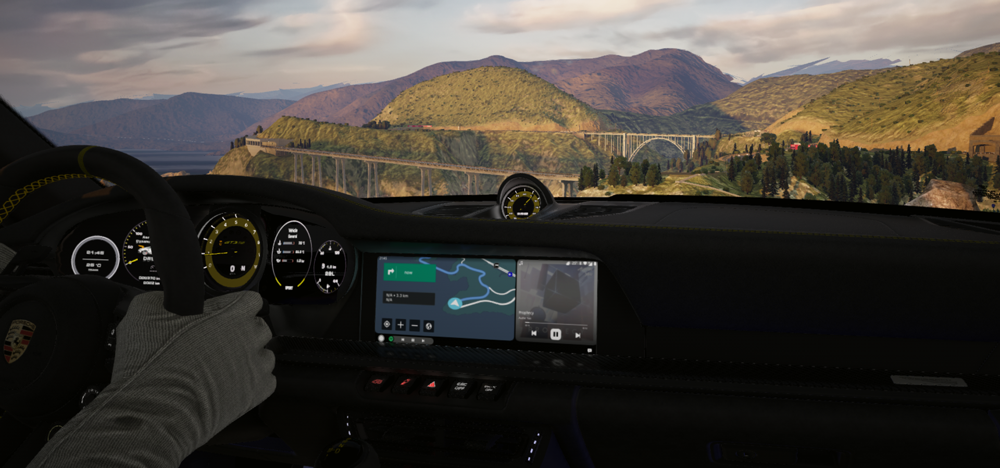

# Android Auto Splitscreen Dashboard for Assetto Corsa 

A more modern Android Auto dashboard for Assetto Corsa featuring a split-screen dashboard with navigation and a redesigned music player.

## Preview

### Demo Video

# Installation

1. Install the latest version of **Custom Shaders Patch**.
2. Extract the files manually and copy it into `assettocorsa/extension/`

3. Choose a car with Android Auto and you should see the Dashboard icon.

4. Click on the Dashboard icon, play any song from Chrome/ Spotify and have fun!

# Features

- Android Auto–inspired split view
- Integrated with existing apps (Backup camera/ Maps)
- Completely redesigned music player
- Dynamic album artwork backgrounds and color themes
- Support layout for multiple resolutions
- Playback progress bar with track duration
- Responsive media controls
- Hidden Easter egg 🤔

## Known Issues

- **Navigator/ Maps is fixed-size**
  - The navigation view is rendered as a separate display, so it cannot currently be fully resized or dynamically scaled within the dashboard.

- **Music playback controls**
  - Rapidly skipping tracks multiple times in succession may cause the music widget to lose synchronization with the current media session. If this occurs, restarting Assetto Corsa restores normal functionality.

## Limitations

These limitations are imposed by the current Custom Shaders Patch API:

- Only one Android Auto app can be active at a time. The dashboard works around this by embedding the Navigator inside a custom dashboard app.
- External media player volume cannot be controlled because the CSP API does not provide access to system media volume.